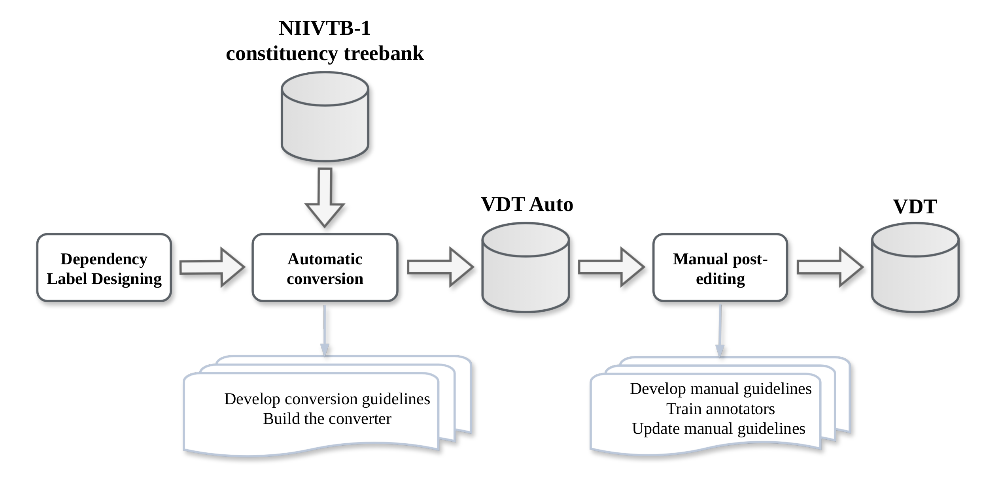

# VDT: A Vietnamese Dependency Treebank via Semi-Automatic Annotation

This repository introduces **VDT (Vietnamese Dependency Treebank)**, a high-precision Vietnamese dependency parsing resource constructed through a semi-automatic annotation framework designed to balance scalability and linguistic quality.

The construction of VDT follows a two-stage pipeline:

- **Phase 1: Automatic Conversion**  
  A Vietnamese-specific rule-based converter transforms the NIIVTB-1 constituency treebank into an initial dependency version, referred to as **VDT Auto**.

- **Phase 2: Manual Post-editing**  
  The automatically converted dependency structures are systematically edited using annotation guidelines and quality-control procedures to produce the final **VDT** dataset.

To support the conversion process, we additionally propose a Vietnamese-oriented dependency label framework tailored to the syntactic characteristics of Vietnamese.

<p align="center">
  
</p>

<p align="center">
  <em>
  At the outset, a dependency label system tailored to Vietnamese is carefully designed. The semi-automatic construction process begins with an automatic conversion phase, where a converter is developed to transform the NIIVTB-1 constituency treebank into the first dependency version, VDT Auto. This version is then edited to rigorous manual annotation to produce the final version, VDT.
  </em>
</p>

## Overview

Vietnamese is a highly analytic language with no morphological inflection, making standard Universal Dependencies (UD) labels insufficient to capture its full syntactic range. VDT addresses this by introducing a label set of **83 dependency relations**, organized into five functional groups:

- subjects-related
- objects-related
- complements-related
- modifiers-related
- extended labels

The label design accounts for language-specific phenomena including Sino-Vietnamese, diverse classifier noun systems, and the language's highly analytic nature.

The treebank contains **10,418 sentences** split as follows:

| Split | Sentences |
|-------|----------:|
| Train | 8,418 |
| Dev   | 1,000 |
| Test  | 1,000 |

<!-- ---

## Dependency Label Set

VDT defines 83 labels organized into five functional groups. Labels marked in **bold** are newly proposed for Vietnamese.

| No. | Label | Explanation | No. | Label | Explanation |
|----:|-------|-------------|----:|-------|-------------|
| 1 | `csubj` | Clausal subject | 42 | **`p_lmod`** | Preposition phrase as locative modifier |
| 2 | `csubj_pass` | Clausal passive subject | 43 | **`v_lmod`** | Verb phrase as locative modifier |
| 3 | `nsubj` | Nominal subject | 44 | **`a_tmod`** | Adjective phrase as temporal modifier |
| 4 | `nsubj_pass` | Passive nominal subject | 45 | **`c_tmod`** | Clause as temporal modifier |
| 5 | **`asubj`** | Adjective phrase as subject | 46 | **`n_tmod`** | Noun phrase as temporal modifier |
| 6 | **`psubj`** | Preposition phrase as subject | 47 | **`p_tmod`** | Preposition phrase as temporal modifier |
| 7 | **`psubj_pass`** | Preposition phrase as passive subject | 48 | **`v_tmod`** | Verb phrase as temporal modifier |
| 8 | **`vsubj`** | Verb phrase as subject | 49 | `num` | Numeric modifier |
| 9 | `n_dobj` | Direct object | 50 | `number` | Number compound modifier |
| 10 | `n_iobj` | Indirect object | 51 | **`det`** | Determiner |
| 11 | **`p_dobj`** | Preposition phrase as direct object | 52 | **`quantmod`** | Modifier of quantifier |
| 12 | **`p_iobj`** | Preposition phrase as indirect object | 53 | **`quantifier`** | Quantifier |
| 13 | `acomp` | Adjectival complement | 54 | **`nc`** | Modifier of noun classifier |
| 14 | `ccomp` | Clausal complement | 55 | **`ncs`** | Modifier of special noun classifier |
| 15 | **`ccomp_pass`** | Clausal complement of a passive verb | 56 | `adjunct` | Adjunct |
| 16 | **`ncomp`** | Nominal complement | 57 | `cc` | Coordinating conjunction |
| 17 | **`pcomp`** | Prepositional complement | 58 | `conj` | Conjunction |
| 18 | **`vcomp`** | Verbal complement | 59 | `intj` | Interjection modifier |
| 19 | **`vcomp_pass`** | Verbal complement of a passive verb | 60 | `mark` | Marker |
| 20 | **`xcomp:a`** | Adjective phrase as open clausal complement | 61 | `parataxis` | Parataxis |
| 21 | **`xcomp:n`** | Noun phrase as open clausal complement | 62 | `punct` | Punctuation |
| 22 | **`xcomp:p`** | Preposition phrase as open clausal complement | 63 | `vocative` | Vocative modifier |
| 23 | **`xcomp:v`** | Verb phrase as open clausal complement | 64 | **`neg`** | Negation modifier |
| 24 | **`a_sc`** | Adjective phrase as subject complement | 65 | **`sino`** | Sino-Vietnamese modifier |
| 25 | **`c_sc`** | Clause as subject complement | 66 | **`sound`** | Sound modifier |
| 26 | **`n_sc`** | Noun phrase as subject complement | 67 | **`timod`** | Title modifier |
| 27 | **`p_sc`** | Preposition phrase as subject complement | 68 | **`acomp:lmod`** | Adjectival complement expressing location |
| 28 | **`v_sc`** | Verb phrase as subject complement | 69 | **`ncomp:lmod`** | Nominal complement expressing location |
| 29 | **`pc_comp`** | Complement of a preposition | 70 | **`pcomp:lmod`** | Prepositional complement expressing location |
| 30 | `pmod` | Prepositional modifier | 71 | **`p_sc:lmod`** | Prep. phrase as subject complement (location) |
| 31 | `rcmod` | Relative clause modifier | 72 | **`acomp:tmod`** | Adjectival complement expressing time |
| 32 | `vmod` | Verbal modifier | 73 | **`ncomp:tmod`** | Nominal complement expressing time |
| 33 | **`amod`** | Adjectival modifier | 74 | **`pcomp:tmod`** | Prepositional complement expressing time |
| 34 | **`dir`** | Directional modifier | 75 | **`vcomp:tmod`** | Verbal complement expressing time |
| 35 | **`nmod`** | Nominal modifier | 76 | **`n_sc:tmod`** | Noun phrase as subject complement expressing time |
| 36 | `advcl` | Adverbial clause modifier | 77 | **`nsubj:timod`** | Noun phrase indicating title as a subject |
| 37 | `n_advmod` | Noun phrase as adverbial modifier | 78 | **`vsubj:timod`** | Verb phrase indicating title as a subject |
| 38 | **`p_advmod`** | Preposition phrase as adverbial modifier | 79 | **`n_dobj:timod`** | Noun phrase indicating title as a direct object |
| 39 | **`v_advmod`** | Verb phrase as adverbial modifier | 80 | **`p_comp:pmod`** | Complement of a preposition without an overt preposition |
| 40 | **`a_lmod`** | Adjective phrase as locative modifier | 81 | **`vcomp_pass:vcomp`** | Passive-meaning verbal complement of a modal verb |
| 41 | **`n_lmod`** | Noun phrase as locative modifier | 82 | `root` | Root |
| | | | 83 | `dep` | Unspecified dependency |

--- -->

## Conversion Pipeline

The converter transforms constituent trees into dependency structures through four main sequential stages:

1. **Head percolation** — assigns a lexical head to each constituent node using language-specific head-finding rules tailored for Vietnamese.
2. **Coordination resolution** — handles symmetric conjunct structures.
3. **Dependency labeling** — assigns one of 83 relation labels to each head–dependent arc based on phrasal categories, functional tags (e.g., `PRD`, `CMP`, `TMP`), and syntactic contexts.
4. **NULL element processing** — resolves traces and empty categories introduced by the original phrase-structure annotation.

Detailed pseudocode for stage **Dependency labeling** is documented in `dependency_labeling_procedures.pdf`, and the implementation is available in the `vdt_converter` directory.

## Reproducing the Conversion Experiments

To reproduce the dependency conversion pipeline and generate the final dependency trees, follow the steps below.

### 1. Download NIIVTB-1

Clone or download the source treebank from:

https://github.com/mynlp/niivtb

Place the `NIIVTB-1/` directory inside `vdt_converter/` with the following structure:

```text
vdt_converter/
└── NIIVTB-1/
    ├── Train/
    ├── Dev/
    └── Test/
```

### 2. Run the Converter

Navigate to the converter directory and execute:

```bash
cd vdt_converter

python main.py --input-dir <path_to_NIIVTB-1> [--base-dir <output_directory>]
```

Example:

```bash
python main.py --input-dir ./NIIVTB-1 --base-dir ./outputs
```

### 3. Output Files

The converter generates two sets of outputs under `<base-dir>/`:

```text
<base-dir>/
├── OneLine/              # Intermediate one-sentence-per-line files
│   ├── Train/
│   ├── Dev/
│   └── Test/
└── VnDep/                # Final CoNLL-U dependency trees
    ├── Train/
    ├── Dev/
    └── Test/
```

- `OneLine/` contains intermediate linearized representations used during preprocessing.
- `VnDep/` contains the final converted dependency trees in CoNLL-U format, which are used in the experiments reported in this work.

## Release Notice

This repository contains an anonymized implementation of the proposed VDT framework. The full paper, annotation guidelines, conversion guidelines, and the final dependency treebank will be publicly released upon paper acceptance.

<!-- ---

## CoNLL-U Format

Each token is represented as a 10-column record:

| Column | Field   | Description                                      |
|--------|---------|--------------------------------------------------|
| 1      | ID      | Token index (1-based)                            |
| 2      | FORM    | Word form                                        |
| 3      | LEMMA   | Underscore (not used)                            |
| 4      | UPOS    | Part-of-speech tag                               |
| 5      | XPOS    | Underscore (not used)                            |
| 6      | FEATS   | Functional tag (e.g., `PRD`, `CMP`, `TMP`)      |
| 7      | HEAD    | Index of the syntactic head (0 for root)         |
| 8      | DEPREL  | Dependency relation label                        |
| 9      | DEPS    | Enhanced dependencies (secondary relations)      |
| 10     | MISC    | Underscore (not used)                            | -->

<!-- ---

## Usage

```bash
python vdt_converter/main.py \
  --input  vdt_converter/NIIVTB-1/ \
  --output output/
```

---

## Citation

If you use VDT in your work, please cite:

```bibtex
@article{vdt2025,
  title   = {VDT: A New Vietnamese Dependency Treebank via Semi-Automatic Annotation},
  author  = {...},
  journal = {...},
  year    = {2025}
}
```

---

## License

*To be specified.* -->
